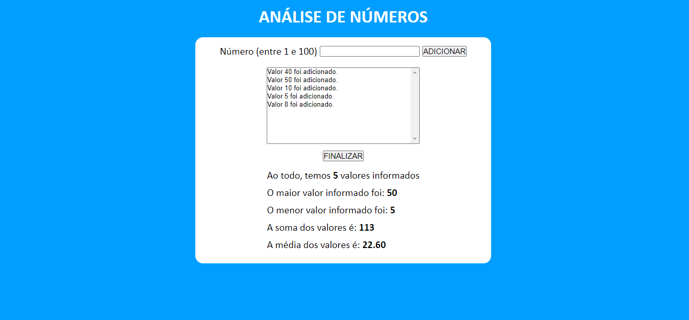

### ANALISANDO NÚMEROS
Um site que recebe valores fornecidos pelo usuário, armazena eles em uma lista, e em seguida fornece:
- A quantidade de valores 
- O maior valor 
- O menor valor 
- A soma de valores 
- A média dos valores

