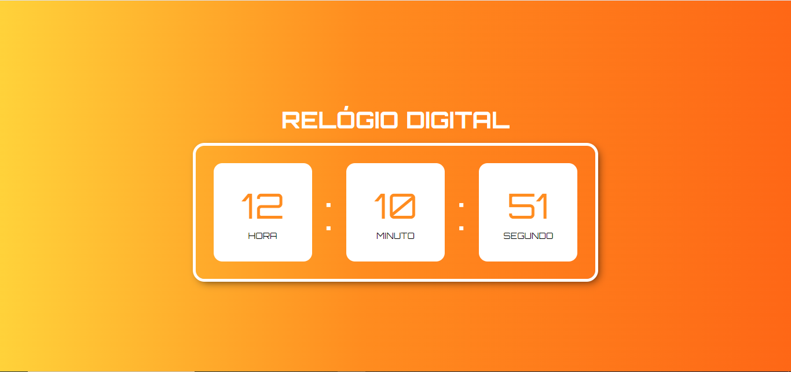
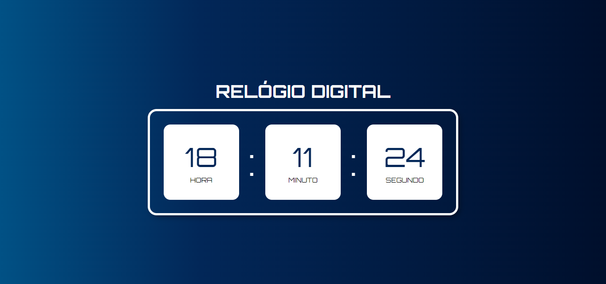

## RELÓGIO DIGITAL

Esse pequeno projeto consiste em um relógio digital programado em JavaScript, com o adicional de que, dependendo do horário do dia, a cor de fundo muda para se adequar.

### HORÁRIO DO DIA

### HORÁRIO DA TARDE

### HORÁRIO DA NOITE
